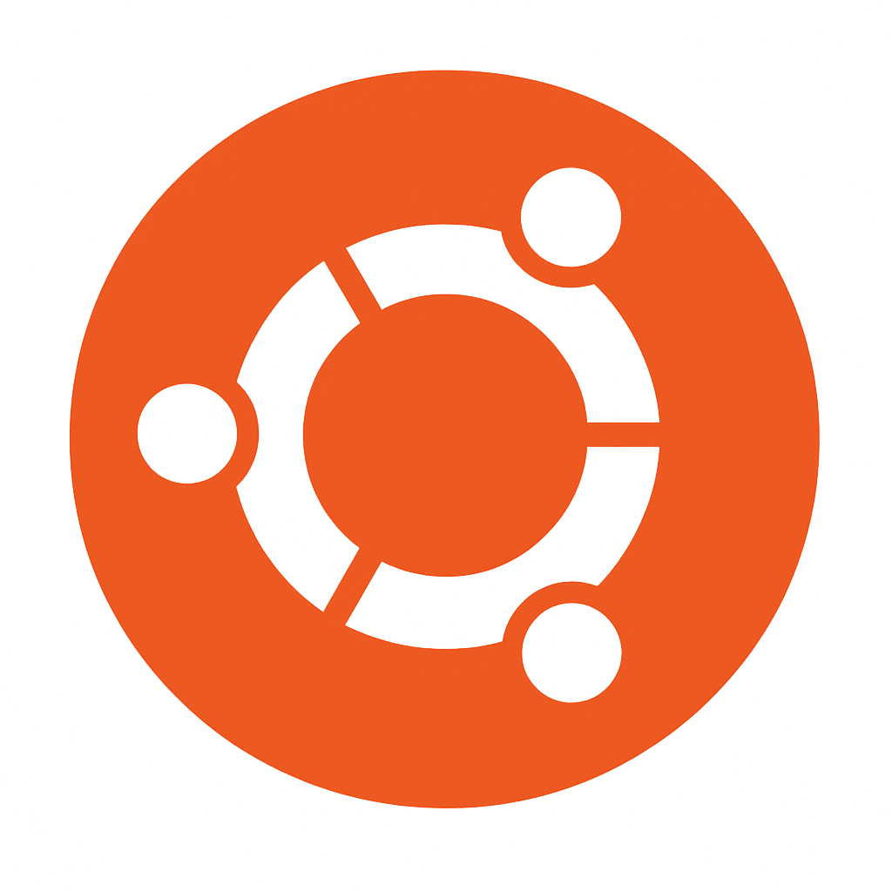

<!-- ===== README.md (Profile) ===== -->

<h1 align="center">Hi 👋, I'm Thanuskanth</h1>
<h3 align="center">Embedded  • Robotics Enthusiast 🤖</h3>

<em>B.Eng.Tech (Hons) in Instrumentation & Automation — University of Colombo</em>

---

🌱 I’m currently learning <strong>ESP-IDF • FreeRTOS • ROS 2 Basics • Computer Vision for Robotics</strong> 
🔧 Recent work: <strong>ESP32 Weather Indicator (1-min uploads)  Line-Following Robot (ATmega328P + L298N + 3× IR)</strong>

---

  

<h3>🔗 Connect with me</h3>

  
  

<h3>🤖 Robotics & AI</h3>

  
  
  
  
  

  
  
  
  

<h3>🧩 Embedded</h3>

  
  
  
  
  

<h3>🛠️ Development Tools</h3>

  
  
  
  
  

---

<h3>📌 Featured Mini-Projects</h3>

- <strong>Solar Phone Charging Hub (DI)</strong> — Portable 10–20 W PV panel, MPPT buck, 2S/3S 18650 pack + BMS, 5 V/9 V USB outputs, enclosure in KiCad + 3D print; optional ESP32 telemetry (voltage, current, SOC) to web dashboard.  
  <em>Repo:</em> <a href="https://github.com/Thanuskanth19/solar-phone-charger-tracker">Thanuskanth19/solar-phone-charging-hub</a> <!-- update if different -->
- <strong>Line-Following Robot</strong> — ATmega328P • L298N • 3× IR array • PID tune notes.  
  <em>Repo:</em> <a href="https://github.com/Thanuskanth19/Linefollowing-robot-and-obstacle-detection.">Thanuskanth19/Linefollowing-robot-and-obstacle-detection</a> <!-- update if different -->

---

### 📊 GitHub Stats

  
  

---

  

<!-- Tips:
1) If the repo link differs, change it above.
2) You can drop a small system block diagram image at /assets/solar_hub_block.png and showcase it here.
3) Ensure /logos/ icons exist or swap to CDN equivalents.
-->
